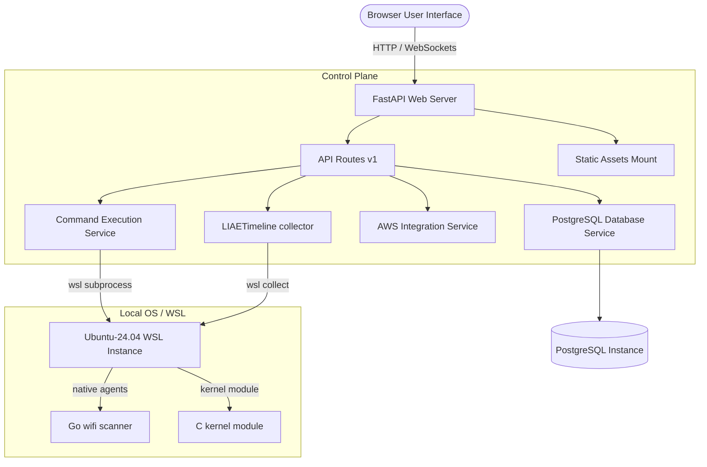

# Architecture Documentation

This document describes the design and structural architecture of Ubuntu Web OS 2.0.

---

## High-Level Diagram

---

## Component Separation

Ubuntu Web OS 2.0 enforces clean separation between the user interface and system level services:

### 1. Frontend Asset Segregation
All web interfaces reside inside the `frontend/` directory.
- `frontend/desktop/` houses the main dashboard, style layouts, window manager interfaces, and window assets.
- `frontend/apps/` houses isolated assets for individual apps (AWS DevOps Console, Developer IDE, LIAE Diagnostics Engine, Spy dashboard, and Wi-Fi manager).

### 2. FastAPI Control Plane
The Python backend resides inside the `backend/` directory, structured as follows:
- `backend/api/`: Router mounts for different domains (authentication, database persistence, terminal execution, system metrics, and liveness check).
- `backend/core/`: Configuration loaders (`config.py`), database pools (`db.py`), structured logging (`logger.py`), and validation utilities (`security.py`).
- `backend/services/`: Specific services for WSL commands execution (`command/`), AWS console simulation (`aws/`), and Live Autopsy Engine chronology records (`liae/`).

### 3. Native compiled agents
Compiled agent binary utilities (such as the Go Wi-Fi scanner or C TCP shell) reside inside the `agents/` directory and are executed by the control plane services.
