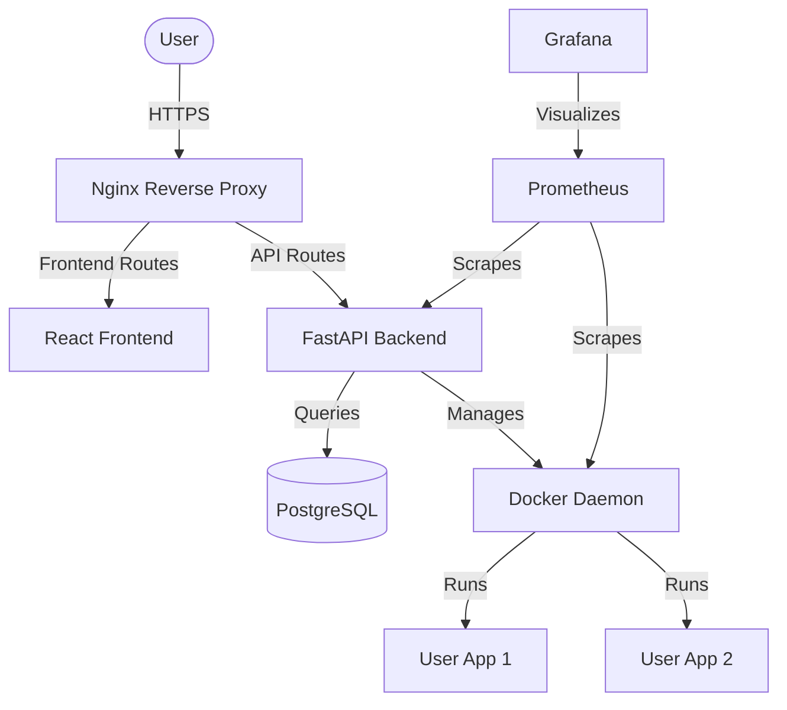

# Mini Hosting Platform Implementation Plan

This document outlines the architecture, components, and phased approach for building a mini hosting platform (Platform-as-a-Service) for deploying your Cognix website and other projects.

## Goal Description

Build a robust, production-ready mini hosting platform that allows for user authentication, GitHub integration, Docker container management, domain/SSL management, and observability (monitoring/databases).

The technology stack will be:
*   **Frontend**: react + Tailwind CSS (React)
*   **Backend**: FastAPI (Python)
*   **Database**: PostgreSQL
*   **Infrastructure**: Docker, Nginx (Reverse Proxy), Linux VPS
*   **Monitoring**: Prometheus, Grafana

## Open Questions

> [!IMPORTANT]
> **Hosting Environment:** Are we going to deploy this on a specific Cloud Provider (e.g., AWS, GCP, DigitalOcean) right away, or should I write the setup so it can be deployed to any generic Ubuntu Linux VPS?

> [!WARNING]
> **Docker Daemon Access:** To manage Docker containers from the FastAPI backend, the backend will need access to the Docker socket (`/var/run/docker.sock`). Is this acceptable for your security model?

> [!TIP]
> **GitHub Integration:** For GitHub deployments, should we use GitHub Webhooks that trigger a build/deploy process on the backend, or a polling mechanism? (Webhooks are recommended for real-time deployments).

## Proposed Architecture

## Phased Approach

### Phase 1: Core Infrastructure & Backend API
*   Set up a `docker-compose.yml` that provisions the base services: PostgreSQL, Redis (if needed for task queues), Prometheus, and Grafana.
*   Initialize the FastAPI backend project.
*   Implement User Authentication (JWT) and User Database models using SQLAlchemy.
*   Implement basic Docker socket integration in FastAPI to list, start, stop, and create containers.

### Phase 2: Frontend Dashboard
*   Initialize the React frontend with Tailwind CSS.
*   Build the Login/Registration flow.
*   Build the Dashboard UI to view active deployments, container status, and resources.
*   Connect the frontend to the FastAPI backend.

### Phase 3: Deployment Pipeline (GitHub to Docker)
*   Implement a webhook endpoint in FastAPI to listen for GitHub push events.
*   Create a background worker (e.g., Celery or FastAPI BackgroundTasks) to handle cloning repos, building Docker images, and spinning up containers.

### Phase 4: Routing & SSL
*   Configure a dynamic Nginx routing system or a reverse proxy (like Traefik) to route traffic from custom domains to the dynamically created user containers.
*   Integrate Let's Encrypt (Certbot) for automatic SSL provisioning for user domains.

## Verification Plan

### Automated Tests
-   Write unit tests for the FastAPI backend focusing on authentication and the Docker API abstraction layer.
-   Run React build tests to ensure the frontend compiles without errors.

### Manual Verification
-   Deploy a sample React/FastAPI application using the newly created platform.
-   Verify that Prometheus successfully scrapes metrics and Grafana dashboards display container resource usage.
-   Ensure Nginx correctly routes a custom domain to the deployed sample application over HTTPS.
