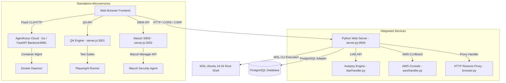

# 🖥️ Ubuntu 24.04 Web OS Desktop - Project Features & Details

An advanced, browser-native desktop environment and system administration console. This workspace exposes a full-featured Ubuntu Web OS desktop interacting directly with a WSL-based Ubuntu 24.04 back-end, bundled with system debugging engines, cloud deployment managers, automated testing utilities, and security dashboards.

---

## 🏛️ System Architecture Overview

The system is split into a **Frontend Desktop UI**, a **Python Secure Command Bridge** (managing WSL), and several **standalone modules** orchestrating hosting, testing, and security.

---

## 🌟 Core Features & Desktop Apps

### 1. 🪟 Draggable & Resizable Multi-Window Manager
*   **Window State Management**: Implements floating, draggable, and resizable window elements. Windows can be minimized to the Taskbar or maximized.
*   **Glassmorphic Design**: Sleek HSL-customizable backdrop filters, border-radius indicators, and shadow offsets creating a highly premium look.
*   **Start Menu**: Launch applications quickly via a searchable start list.
*   **Taskbar**: Bottom-anchored panel displaying running tasks, real-time clock, status indicators, and a control center tray.

### 2. ⚡ Control Center & Quick Settings
*   **System Tray Toggle**: Unified tray element showing Wi-Fi, volume, and battery status. Clicking opens a Quick Settings popup.
*   **Toggles & Sliders**: Quick action buttons for Wi-Fi, Bluetooth, Aeroplane Mode, and Do Not Disturb, alongside volume and display brightness sliders.
*   **Wi-Fi Manager**: Integrates with a Go-based CLI scanner (`wifi.go`/`wifi.exe`) supporting:
    *   WLAN scanning and listing network signal strength.
    *   Dynamic WLAN XML Profile creation for Windows connections (`netsh wlan`).
    *   Simulated fallback Wi-Fi environments for setups lacking physical Wi-Fi cards.

### 3. 📟 Interactive Terminal (Xterm.js)
*   **xterm.js Integration**: Full terminal emulation supporting standard commands.
*   **Streaming Execution**: Incremental stdout/stderr streaming via the `/api/command_stream` endpoint.
*   **Safety Restrictions**: Disallows dangerous shell commands (`rm -rf /`, `shutdown`, `reboot`, etc.) through pre-flight token scanning.

### 4. 📁 File Manager & Tabbed Code Editor
*   **Directory Navigation**: Double-click navigation, directory creation (`mkdir -p`), renaming, and file deletion.
*   **Permission (chmod) Inspector**: View file owners, size, paths, and update Read/Write/Execute permissions via a GUI checkbox grid.
*   **Code Editor (Monaco Editor)**: Real-time tabbed developer editor with syntax highlighting, search/replace (Ctrl+F), and dynamic autosave.
*   **Archiving**: Compress folders or files into `.tar.gz` format via the UI.

### 5. 📊 System Monitor & Task Manager (htop-like)
*   **System Metrics**: Displays CPU load, memory utilization, disk space, and network throughput charts.
*   **Task List**: Interactive table parsing WSL `ps aux`. Allows filtering, sorting by memory/CPU, and ending tasks using `kill -9 <PID>`.

### 6. 🛒 App Store (APT Package Manager)
*   **Package Search**: Queries the APT cache using `apt-cache search` with output truncation.
*   **Simulated & Real Installation**: Visual progress indicators updating from standard apt output during `apt-get install` sessions. Supports package info caching (`apt-cache show`).

---

## 🧬 Live Infrastructure Autopsy Engine (LIAE)

The LIAE is a **black box recorder** and debugging engine tracking OS, container, network, and database layers.

*   **Circular Timeline Recorder**: Runs as a background daemon, taking snapshots every `1.5` seconds. Stores up to 1800 records (30 minutes of history).
*   **Timeline Scrubber**: Horizontal timeline scrubber allows administrators to scrub backwards in time. The entire workspace dashboard updates to show exact metrics (CPU, Memory, Disk, Active TCP connections) at that moment.
*   **Multi-Layer Correlation**: Highlights concurrent anomalies across processes (WSL `ps`), containers (Docker), authorization attempts (`/var/log/auth.log`), and networks.
*   **Snapshot Diffing**: Select two points in time (T1 vs T2) to see process delta lists, container state changes, and memory deviation statistics.
*   **Predictive Anomalies**: Raises warning and critical alerts for low memory thresholds, CPU spikes (>80%), network connection surges, or degraded Docker containers.

---

## ☁️ AWS Topology & Failover Console

A visualization engine showing real AWS resource structures or a simulated DevOps dashboard:
*   **Dynamic Topology Map**: Renders VPC structures, Subnet partitions (Public vs. Private), Internet Gateways, NAT Gateways, EC2 instances, ECR repositories, Route 53 DNS records, and EKS Kubernetes clusters.
*   **RDS Failover Simulator**: Triggers a simulated failover of an RDS Multi-AZ database cluster, shifting roles between Primary and Reader nodes across availability zones (`us-east-1a`, `us-east-1b`, `us-east-1c`) with visual propagation alerts.
*   **Real Connection Support**: Connects to actual AWS configurations via credentials (`~/.aws/credentials`) and utilizes the Python `boto3` client when enabled.

---

## 🚀 Agenthoryx Cloud (Mini-Hosting Platform)

A self-hosted PaaS modeled after Vercel and GoDaddy:
*   **Git Automation**: Automatically clones, pulls, and builds repositories into Docker containers.
*   **Replicated Load Balancing**: Supports scaling dynamic containers (up to 10 replicas). Features a Round-Robin load-balancing proxy rotating requests across replicas.
*   **SSL & DNS Checks**: Pre-flight verification checking public DNS `A` records against host IPs, followed by dynamic Let's Encrypt SSL certificate provisioning.

---

## 🧪 QA Testing Engine

An automated quality assurance dashboard powered by Playwright:
*   **Suite Manager**: List, read, and write Playwright test specs directly inside the browser environment.
*   **Execution Stream**: Stream stdout and stderr in real-time using EventStream (`text/event-stream`).
*   **Slack Webhook Integration**: Auto-triggers failure notifications to target Slack/Discord channels on test suite failures.
*   **Job Scheduler**: Schedule automated recurring runs for test suites.

---

## 🛡️ Wazuh SIEM Security Dashboard

A security event monitoring UI that pulls from live Wazuh APIs or falls back to a simulated interface:
*   **Alert logs**: Level-based event log reporting (e.g., SSHD brute force attempts, PAM log sessions).
*   **File Integrity Monitor (FIM)**: Tracks file mutations across system directories (`/etc/passwd`, `/etc/nginx/nginx.conf`).
*   **Vulnerability Scanner**: Identifies packages exposed to CVE risks with severity classifications.

---

## 🛠️ Configuration & Database Details

### PostgreSQL Schema
The web application uses PostgreSQL for configuration, sessions, and note persistence:

*   `os_notes`:
    *   `id`: `SERIAL PRIMARY KEY`
    *   `content`: `TEXT`
    *   `updated_at`: `TIMESTAMP`
*   `os_settings`:
    *   `id`: `SERIAL PRIMARY KEY`
    *   `settings`: `JSONB` (stores windows layouts, wallpaper URLs, shortcuts, theme variables)
    *   `updated_at`: `TIMESTAMP`
*   `os_sessions`:
    *   `session_id`: `TEXT PRIMARY KEY`
    *   `username`: `TEXT`
    *   `csrf`: `TEXT`
    *   `exp`: `FLOAT` (expiry epoch)

### Security Settings (.env)
*   `OS_WEBOS_SESSION_SECRET`: Key for signature verification.
*   `OS_WEBOS_USER` / `OS_WEBOS_PASS`: Administrator login credentials.
*   `OS_WEBOS_RATE_LIMIT_MAX`: Request frequency limits (defaults to `300` per minute).
*   `OS_WEBOS_MAX_REQUEST_BYTES` / `OS_WEBOS_MAX_JSON_BYTES`: Limits request size to block large payload DoS vectors (defaults to `64 KB`).
*   `OS_WEBOS_MAX_STDOUT_BYTES` / `OS_WEBOS_MAX_STDERR_BYTES`: Limits command outputs (truncated at `32 KB` / `16 KB`).
